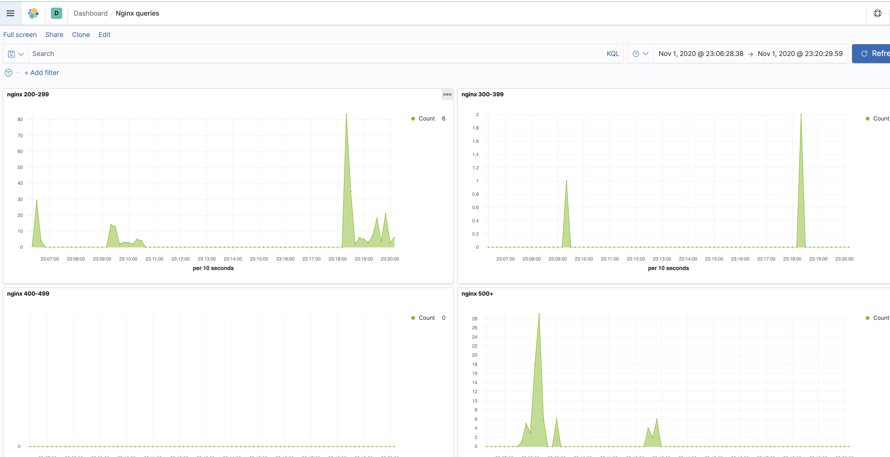

### Подготовка Kubernetes кластера

1) настроил кластер на 2 пула(default, infra)
2) в пуле infra добавил taints
```node-role=infra:NoSchedule```
3) проверяем конфигурацию кластера
~~~
kubectl get nodes
> 
NAME                                                  STATUS   ROLES    AGE   VERSION
gke-kubernetes-monitorin-default-pool-53b55f48-s9k8   Ready    <none>   79s   v1.16.13-gke.401
gke-kubernetes-monitoring-infra-72b90197-13xw         Ready    <none>   88s   v1.16.13-gke.401
gke-kubernetes-monitoring-infra-72b90197-2zp2         Ready    <none>   88s   v1.16.13-gke.401
gke-kubernetes-monitoring-infra-72b90197-wjwz         Ready    <none>   88s   v1.16.13-gke.401
~~~


### Установка hipster-shop
-  устанавливаем знакомый hipster-shop 

~~~
kubectl create ns microservices-demo
kubectl apply -f https://raw.githubusercontent.com/express42/otus-platform-snippets/master/Module-02/Logging/microservices-demo-without-resources.yaml -n microservices-demo
~~~

- смотрим на развернутые поды
~~~
kubectl get pods -n microservices-demo
> 
NAME                                     READY   STATUS    RESTARTS   AGE
adservice-cb695c556-2c9bc                1/1     Running   0          3m6s
cartservice-f4677b75f-r4zm6              1/1     Running   2          3m10s
checkoutservice-664f865b9b-m64bm         1/1     Running   0          3m16s
currencyservice-bb9d998bd-vstt2          1/1     Running   0          3m9s
emailservice-6756967b6d-t22dc            1/1     Running   0          3m17s
frontend-766587959d-z4k89                1/1     Running   0          3m13s
loadgenerator-9f854cfc5-smlhx            1/1     Running   4          3m9s
paymentservice-57c87dc78b-vn4zx          1/1     Running   0          3m12s
productcatalogservice-9f5d68b54-9xjf5    1/1     Running   0          3m11s
recommendationservice-57c49756fd-572dx   1/1     Running   0          3m15s
redis-cart-5f75fbd9c7-ttps4              1/1     Running   0          3m7s
shippingservice-689c6457cd-k7phw         1/1     Running   0          3m8s
~~~

### Установка EFK стека | Helm charts

- устанавливаем EFK через HELM
~~~
helm repo add elastic https://helm.elastic.co

kubectl create ns observability
# ElasticSearch
helm upgrade --install elasticsearch elastic/elasticsearch --namespace observability
# Kibana
helm upgrade --install kibana elastic/kibana --namespace observability
# Fluent Bit
helm upgrade --install fluent-bit stable/fluent-bit --namespace observability
~~~
- смотрим на поды -- запуститься они не смогли(так как у нас ток одна нода, где можно запускаться норм)
~~~
wh0106259:Mikhail-M_platform mikhail.maryufich$ kubectl get pods -n observability
NAME                             READY   STATUS              RESTARTS   AGE
elasticsearch-master-0           0/1     Pending             0          53s
elasticsearch-master-1           0/1     Pending             0          53s
elasticsearch-master-2           0/1     Pending             0          53s
fluent-bit-ldvg4                 0/1     ContainerCreating   0          35s
kibana-kibana-657d46b9c4-fknh4   0/1     Running             0          50s
~~~
- пропишем tolerations и nodeSelector для эластика в ```elasticsearch.values.yaml``` и проабдейтим релиз

~~~
helm upgrade --install elasticsearch elastic/elasticsearch --namespace observability -f elasticsearch.values.yaml
~~~
- смотрим, что все стало четко
~~~
 kubectl get pods -n observability -o wide -l chart=elasticsearch
~~~
- все четко, правда оказалось, что сразу выделил E2, а не N1 и пришлось пересоздавать пул

### Установка nginx-ingress
- перед этим установим ServiceMonitor
~~~
kubectl apply -f https://raw.githubusercontent.com/helm/charts/master/stable/prometheus-operator/crds/crd-servicemonitor.yaml
~~~
- устанавливаем nginx-ingress через helm 
~~~
helm repo add ingress-nginx https://kubernetes.github.io/ingress-nginx
helm repo add stable https://charts.helm.sh/stable
helm repo update

kubectl create ns ingress-nginx
helm install ingress-nginx ingress-nginx/ingress-nginx -f ingress-nginx.values.yaml
~~~
- установился, external-ip получился следующий 35.225.44.17
- поставим заодно и прометея
~~~
helm upgrade --install prometheus choerodon/kube-prometheus -n observability -f prometheus-operator.values.yaml
~~~

### возращаемся к EFK
- обновим релиз kibana
~~~
helm upgrade --install kibana elastic/kibana --namespace observability -f kibana.values.yaml
~~~
- обновим fluent-bit, попутно смотря в логи
~~~
helm upgrade --install fluent-bit stable/fluent-bit --namespace observability -f fluent-bit.values.yaml
~~~
- установим elastic exporter
~~~
helm upgrade --install elasticsearch-exporter stable/elasticsearch-exporter --set es.uri=http://elasticsearch-master:9200 --set serviceMonitor.enabled=true --namespace=observability
~~~
- импортировал https://grafana.com/grafana/dashboards/4358 и поиграл, посмотрел -- круто

- поиграл с этим алертом, пока не разобрался как заставить прометеус принять это как правило, просто исполнял запрос в админке и ронял-поднимал ноды
~~~
ALERT ElasticsearchTooFewNodesRunning
 IF elasticsearch_cluster_health_number_of_nodes < 3
 FOR 5m
 LABELS {severity="critical"}
 ANNOTATIONS {description="There are only {{$value}} < 3 ElasticSearch nodes
running", summary="ElasticSearch running on less than 3 nodes"}
~~~

- поиграл с кибаной и экспортировал дашборду


