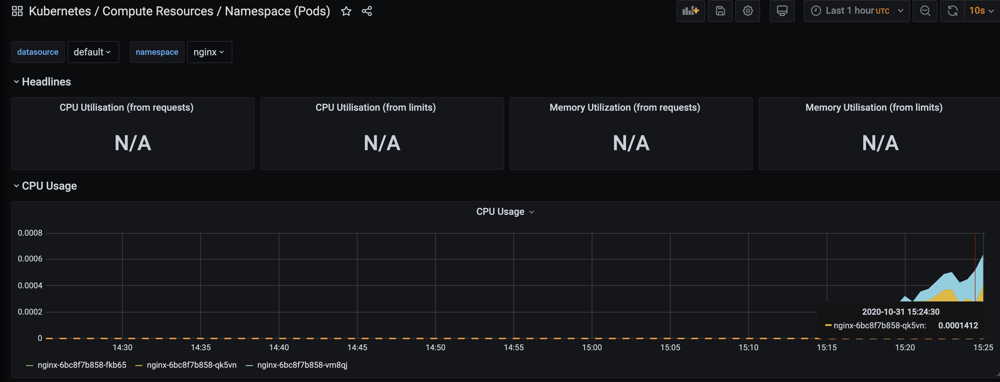
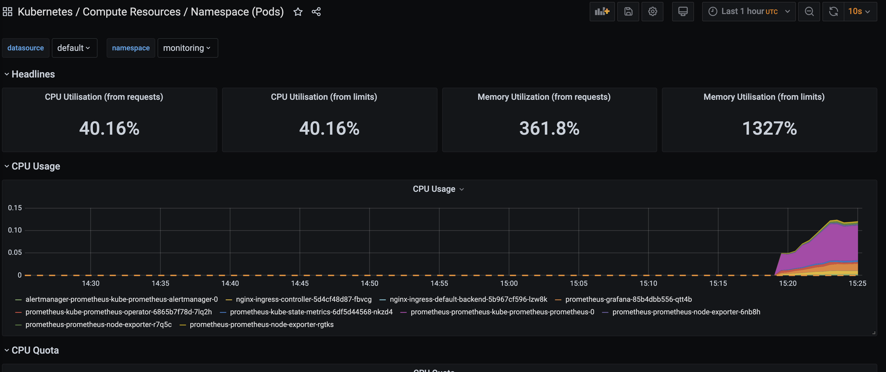

Деплоим в кластер прометея:
- ставим prometheus-operator в кластер

~~~
kubectl create ns monitoring
helm install prometheus choerodon/kube-prometheus --version 9.3.1 -n monitoring  
    --set prometheus.prometheusSpec.serviceMonitorSelectorNilUsesHelmValues=false  
    --set prometheus.prometheusSpec.podMonitorSelectorNilUsesHelmValues=false
~~~
- Докидываем stub_status в nginx с помощью config_map ```nginx-config-map.yaml```
~~~
kubectl apply -f nginx-config-map.yaml
~~~
- Деплоймент
~~~
kubectl apply -f nginx-deployment.yaml
kubectl apply -f nginx-service.yaml
kubectl apply -f service_monitor.yaml
~~~

смотрим в графане метрики 

Granafa nginx 



Granafa node


